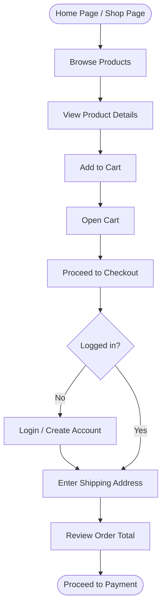
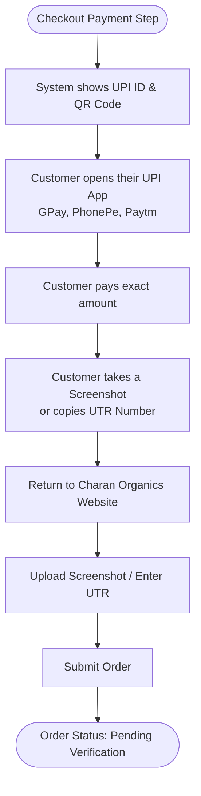
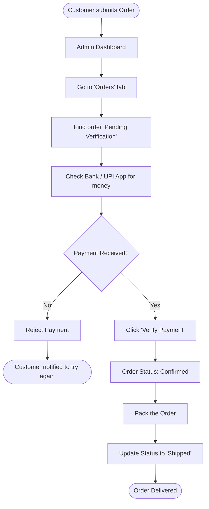
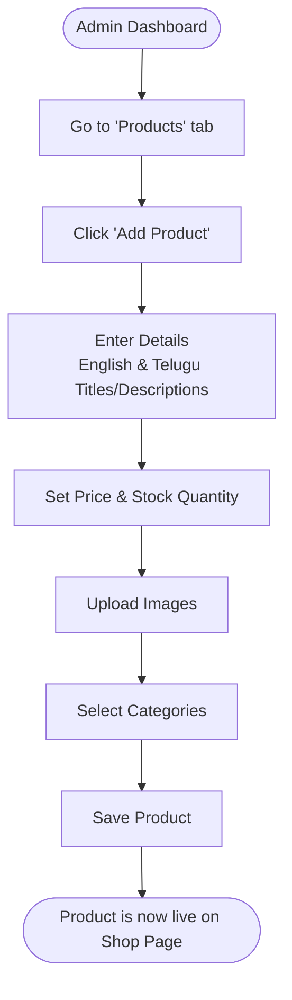

# Charan Organics - Visual User Manual

This document provides simple flowcharts to understand how the Charan Organics platform works for both Customers and Administrators.

---

## 🛍️ 1. Customer Shopping Flow
How a customer browses the website, adds items to their cart, and places an order.

---

## 💸 2. Customer Payment Flow (UPI)
How a customer completes their payment using UPI and uploads proof.

---

## 👑 3. Administrator: Order Fulfillment Flow
How the admin receives a new order, verifies the payment, and ships the products.

---

## 📦 4. Administrator: Product Management Flow
How the admin adds new products to the store.

